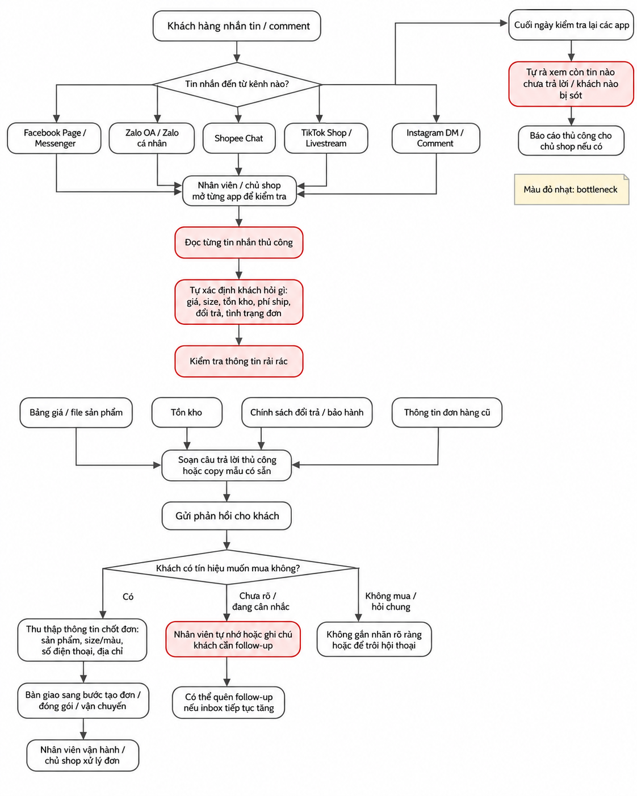
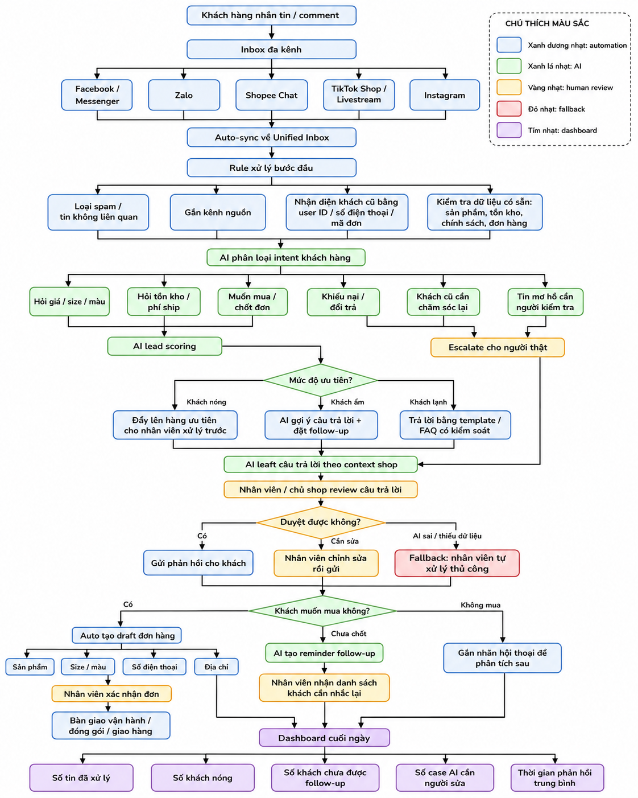

# 01 — Individual Problem Scan

## Case: AI Inbox Operator cho shop online Việt Nam

> Bài này phân tích vấn đề xử lý inbox đa kênh của shop online Việt Nam theo hướng **problem first, not AI first**. Mục tiêu không phải bắt đầu bằng “làm chatbot” hay “xây agent”, mà bắt đầu từ actor, workflow hiện tại, bottleneck, impact và metric đo được.

---

## Case ví dụ

Tôi quan sát các shop online Việt Nam bán hàng qua nhiều kênh như Facebook Page, Zalo, Shopee, TikTok Shop, Instagram và livestream. Mỗi ngày shop nhận nhiều tin nhắn, comment và câu hỏi từ khách hàng về giá, size, màu, tồn kho, phí ship, tình trạng đơn, đổi trả, khuyến mãi và cách đặt hàng.

Người đau chính là **chủ shop, nhân viên trực inbox, nhân viên chốt đơn và khách hàng**. Chủ shop hoặc nhân viên phải mở nhiều app khác nhau, đọc từng tin nhắn, tự phân loại khách nào cần xử lý trước, tự kiểm tra thông tin sản phẩm, tự trả lời, tự ghi nhớ khách nào cần follow-up và cuối ngày tự rà lại xem có bị sót khách không.

Vấn đề không chỉ là “trả lời nhiều tin nhắn”, mà là:

- Tin nhắn phân tán ở nhiều nền tảng.
- Khách có ý định mua cao dễ bị trôi.
- Nhân viên phản hồi chậm hoặc thiếu nhất quán.
- Chủ shop khó kiểm soát chất lượng xử lý inbox.
- Chi phí nhân sự tăng khi lượng inbox tăng.
- Không đo được rõ mỗi hội thoại tốn bao nhiêu chi phí và tạo ra bao nhiêu giá trị.

Ý tưởng ban đầu không phải là làm chatbot tự động trả lời toàn bộ. Tôi muốn bắt đầu từ workflow thật:

```text
Khách nhắn
→ Shop đọc
→ Phân loại
→ Kiểm tra thông tin
→ Trả lời
→ Chốt đơn hoặc follow-up
→ Kiểm tra cuối ngày
```

Từ đó mới xem bước nào chỉ cần rule, bước nào cần workflow tự động, bước nào cần AI hỗ trợ, và bước nào vẫn phải có người thật kiểm tra.

---

## Vì sao đây là case tốt?

- Có actor cụ thể: chủ shop, nhân viên inbox, nhân viên chốt đơn, khách hàng.
- Có workflow lặp lại hằng ngày.
- Có bottleneck rõ: đọc nhiều inbox, phân loại thủ công, kiểm tra thông tin rải rác, follow-up thủ công.
- Có impact đo được: thời gian phản hồi, số tin bị sót, số hội thoại/nhân viên/ngày, tỷ lệ follow-up, tỷ lệ chốt đơn.
- Có yếu tố chi phí: chi phí nhân sự, chi phí LLM, cost per conversation, cost per lead.
- Có thể so sánh No AI / Rule / Workflow / Agent.
- Có thể vẽ before/after workflow rõ ràng.
- Có thể pilot nhỏ với 1-2 kênh trước, chưa cần xây hệ thống quá lớn.

---

# 01 — Individual Problem Scan

## Scan rộng

Tôi scan 15 problems, vượt mức tối thiểu 5 problems. Các problems này xoay quanh trải nghiệm của shop online khi xử lý inbox đa kênh.

| # | Lăng kính | Problem quan sát được | Ai đang đau? | Dấu hiệu thật |
|---|---|---|---|---|
| 1 | Lặp lại / Tốn thời gian | Chủ shop hoặc nhân viên phải kiểm tra inbox từ nhiều nền tảng khác nhau như Facebook, Zalo, Shopee, TikTok, Instagram | Chủ shop, nhân viên CSKH/sales inbox | Mỗi ngày phải mở nhiều app; dễ quên trả lời hoặc trả lời trễ khách |
| 2 | Lặp lại | Khách hỏi đi hỏi lại các câu giống nhau: giá, size, màu, còn hàng không, phí ship, đổi trả | Nhân viên inbox, khách hàng | Nhiều câu hỏi trùng lặp mỗi ngày nhưng vẫn phải gõ lại hoặc copy thủ công |
| 3 | Tốn thời gian | Khi khách hỏi sản phẩm, nhân viên phải tự kiểm tra bảng giá, tồn kho, ảnh sản phẩm, chương trình khuyến mãi | Nhân viên bán hàng | Thông tin nằm rải rác ở file, sheet, app bán hàng hoặc trí nhớ của chủ shop |
| 4 | AI có thể tốt hơn | Tin nhắn khách hàng có mức độ ưu tiên khác nhau nhưng shop thường xử lý theo thứ tự nhìn thấy trước | Chủ shop, sales inbox | Khách có ý định mua cao có thể bị trôi giữa nhiều tin hỏi chung chung |
| 5 | Pain từ người khác | Khách phàn nàn shop phản hồi chậm hoặc hỏi rồi không thấy ai trả lời | Khách hàng, chủ shop | Khách có thể chuyển sang shop khác nếu không được trả lời kịp |
| 6 | Tốn thời gian / Lặp lại | Nhân viên phải tự nhớ khách nào đã hỏi, khách nào đang cân nhắc, khách nào cần follow-up | Sales inbox, chủ shop | Hay quên nhắn lại khách sau khi tư vấn, đặc biệt khi khách nói “để mình suy nghĩ” |
| 7 | AI có thể tốt hơn | Comment trên livestream hoặc bài đăng có nhiều khách hỏi mua nhưng khó gom lại thành danh sách khách tiềm năng | Chủ shop, nhân viên livestream | Comment trôi nhanh, dễ sót người muốn mua hoặc hỏi thông tin quan trọng |
| 8 | Lặp lại / Tốn thời gian | Sau khi khách muốn mua, nhân viên phải copy thông tin khách sang sheet hoặc hệ thống đơn hàng | Nhân viên chốt đơn, vận hành | Dễ nhập thiếu số điện thoại, địa chỉ, sản phẩm, size/màu |
| 9 | Pain từ người khác | Nhân viên mới không biết trả lời khách theo đúng tone và chính sách của shop | Chủ shop, nhân viên mới | Phải hỏi lại chủ shop nhiều lần; câu trả lời giữa các nhân viên không đồng nhất |
| 10 | AI có thể tốt hơn / Tốn thời gian | Chủ shop khó biết cuối ngày có bao nhiêu khách hỏi, bao nhiêu khách nóng, bao nhiêu khách chưa được xử lý | Chủ shop | Không có dashboard rõ; phải tự đọc lại inbox hoặc hỏi nhân viên |
| 11 | Tốn thời gian / Chi phí | Khi lượng inbox tăng, shop phải thuê thêm nhân viên trực chat dù nhiều việc chỉ là trả lời câu hỏi lặp lại | Chủ shop | Chi phí nhân sự tăng theo số lượng tin nhắn |
| 12 | AI có thể tốt hơn / Chi phí | Không phải tin nhắn nào cũng cần người thật xử lý, nhưng hiện tại mọi tin đều tiêu tốn thời gian nhân viên như nhau | Chủ shop, nhân viên CSKH | Tin đơn giản và khách có ý định mua cao bị xử lý lẫn lộn |
| 13 | AI có thể tốt hơn | Shop không tự động nhận biết khách cũ, khách tiềm năng và khách cần chăm sóc lại | Sales inbox, chủ shop | Nhân viên phải nhớ thủ công hoặc tự tìm lại lịch sử chat |
| 14 | Tốn thời gian / Quản trị | Chủ shop không biết chi phí xử lý mỗi khách inbox là bao nhiêu | Chủ shop | Không đo được cost/conversation, cost/lead, cost/order |
| 15 | Pain từ người khác | Khách phải nhắc lại thông tin đã gửi trước đó vì nhân viên không nhìn được lịch sử đầy đủ | Khách hàng, nhân viên inbox | Khách khó chịu vì đã gửi size/số điện thoại/địa chỉ nhưng vẫn bị hỏi lại |

---

## Vì sao phần scan này mạnh?

- Có scan rộng trước khi hội tụ.
- Có nhiều hơn 5 problems, đủ điều kiện lấy bonus scan rộng.
- Có nhiều lăng kính khác nhau: lặp lại, tốn thời gian, AI có thể tốt hơn, pain từ người khác, chi phí.
- Mỗi problem có actor rõ: chủ shop, nhân viên inbox, nhân viên chốt đơn, khách hàng.
- Mỗi problem có dấu hiệu thật hoặc dấu hiệu có thể kiểm chứng.
- Không bắt đầu bằng “làm chatbot” hoặc “xây agent”.
- Có nhiều problem gắn trực tiếp với business value: giảm chi phí nhân sự, giảm bỏ sót khách, tăng tỷ lệ follow-up, tăng khả năng chốt đơn.
- Có thể chọn một problem đủ hẹp để đào sâu trong lab, thay vì ôm toàn bộ “AI bán hàng tự động”.

---

## Top 3

| Rank | Problem | Vì sao chọn | Điều còn chưa chắc |
|---|---|---|---|
| 1 | Tin nhắn khách hàng từ nhiều nền tảng bị phân tán, dễ bỏ sót và phản hồi chậm | Actor rõ, workflow rõ, pain thật với nhiều shop online; có thể đo bằng thời gian phản hồi, số tin bị bỏ sót, số khách chưa xử lý | Cần biết shop cụ thể đang dùng bao nhiêu kênh, số lượng tin nhắn/ngày và hiện tại bị sót bao nhiêu tin |
| 2 | Nhân viên mất nhiều thời gian trả lời các câu hỏi lặp lại nhưng vẫn cần đúng ngữ cảnh sản phẩm, tồn kho, chính sách | Có tần suất cao, bottleneck rõ, có thể dùng rule + AI workflow để hỗ trợ; impact trực tiếp tới thời gian xử lý | Cần phân biệt câu nào chỉ cần rule/template, câu nào cần AI hiểu ngữ cảnh |
| 3 | Shop không biết khách nào có ý định mua cao để ưu tiên xử lý và follow-up | Có impact trực tiếp tới doanh thu; AI có thể hỗ trợ phân loại intent, lead scoring và gợi ý next action | Khó đo chính xác “ý định mua cao”; cần validation bằng dữ liệu inbox thật hoặc phỏng vấn chủ shop |

---

# Problem Card #1 — Inbox đa kênh bị phân tán, dễ bỏ sót khách

## Problem 1 câu

Shop online nhận tin nhắn từ nhiều nền tảng khác nhau nên chủ shop/nhân viên dễ bỏ sót khách, phản hồi chậm và mất cơ hội chốt đơn.

## Actor

Chủ shop hoặc nhân viên CSKH/sales inbox của shop online Việt Nam.

## Thời điểm / bối cảnh

Hằng ngày, đặc biệt sau khi shop:

- chạy quảng cáo,
- livestream,
- đăng bài sản phẩm mới,
- có chương trình khuyến mãi,
- nhận nhiều comment/inbox cùng lúc.

## Current workflow

```text
1. Khách nhắn tin hoặc comment từ nhiều kênh: Facebook, Zalo, Shopee, TikTok, Instagram.
2. Nhân viên/chủ shop mở từng app để kiểm tra.
3. Đọc từng tin nhắn thủ công.
4. Tự xác định khách đang hỏi gì: giá, size, tồn kho, phí ship, đổi trả, tình trạng đơn.
5. Tự kiểm tra thông tin ở nhiều nơi: bảng giá, tồn kho, chính sách, lịch sử đơn hàng.
6. Soạn câu trả lời thủ công hoặc copy mẫu có sẵn.
7. Nếu khách muốn mua, nhân viên thu thập thông tin để chốt đơn.
8. Nếu khách chưa chốt, nhân viên tự nhớ hoặc ghi chú để follow-up.
9. Cuối ngày tự rà lại các app để xem còn tin nào bị sót không.
```

## Bottleneck

Bottleneck chính nằm ở 3 điểm:

1. **Tin nhắn phân tán ở nhiều nền tảng** nên nhân viên phải mở nhiều app và dễ bỏ sót.
2. **Phân loại khách thủ công** nên khách có ý định mua cao không được ưu tiên kịp thời.
3. **Follow-up thủ công** nên khách đã hỏi nhưng chưa chốt dễ bị quên.

Ước lượng thời gian:

```text
Mỗi lần kiểm tra inbox đa kênh: 10-20 phút
Mỗi hội thoại cần đọc + phân loại + kiểm tra thông tin: 2-5 phút
Cuối ngày rà lại tin nhắn: 15-30 phút
```

## Impact

- Khách phải chờ lâu hơn.
- Shop dễ bỏ sót khách có nhu cầu mua thật.
- Nhân viên bị quá tải khi inbox tăng.
- Chủ shop khó kiểm soát chất lượng trả lời.
- Chi phí nhân sự tăng nếu shop muốn xử lý nhiều khách hơn.
- Không đo được rõ cost per conversation hoặc số khách tiềm năng bị mất.

## Success metric

| Metric | Trước tối ưu | Sau kỳ vọng |
|---|---:|---:|
| Thời gian phản hồi trung bình | 10-15 phút hoặc hơn khi cao điểm | Dưới 5 phút với tin phổ biến |
| Số tin bị bỏ sót mỗi ngày | Chưa đo rõ / có thể xảy ra thường xuyên | Giảm 50-80% |
| Số hội thoại/nhân viên/ngày | Ví dụ 100-150 | Tăng lên 200-300 |
| Tỷ lệ khách cần follow-up được nhắc lại | Thấp / phụ thuộc trí nhớ nhân viên | Có danh sách rõ cuối ngày |
| Thời gian rà inbox cuối ngày | 15-30 phút | Dưới 10 phút nhờ dashboard |
| Cost per conversation | Chưa đo | Có thể đo bằng thời gian nhân sự + chi phí AI |

## Non-AI alternative

- Dùng một công cụ gom inbox đa kênh.
- Tạo checklist xử lý tin nhắn.
- Chia ca trực inbox.
- Dùng tin nhắn mẫu/FAQ.
- Gắn nhãn thủ công: khách nóng, khách đang cân nhắc, khách đã mua, khách khiếu nại.
- Dùng Google Sheet để theo dõi khách cần follow-up.

## AI hypothesis

AI không nên tự động thay toàn bộ nhân viên ngay từ đầu. AI nên hỗ trợ một số bước trong workflow:

- Phân loại intent của khách.
- Nhận diện khách cũ nếu có dữ liệu.
- Gắn nhãn khách nóng/ấm/lạnh.
- Gợi ý câu trả lời theo thông tin sản phẩm và chính sách shop.
- Nhắc nhân viên follow-up khách chưa chốt.
- Tạo dashboard cuối ngày: số tin đã xử lý, số khách nóng, số khách chưa follow-up, số case cần người thật xử lý.

Người thật vẫn cần review trước khi gửi ở giai đoạn đầu, đặc biệt với các case như khiếu nại, hoàn tiền, đổi trả, giảm giá, cam kết tồn kho hoặc thông tin nhạy cảm.

## Quick gut

```text
Workflow.
```

Lý do:  
Bài toán này không chỉ là một rule đơn giản, nhưng cũng chưa cần agent tự làm toàn bộ. Workflow hợp lý hơn vì có các bước rõ: sync inbox → rule/database → AI phân loại → AI draft → người thật review → gửi/follow-up → dashboard.

---

## Draft current workflow

```text
CURRENT STATE — xử lý thủ công, dễ sót khách

[1 Khách nhắn/comment từ nhiều kênh]
→ [2 Nhân viên mở từng app]
→ [3 Đọc từng tin nhắn]
→ [4 Tự phân loại câu hỏi]
→ [5 Kiểm tra giá/tồn kho/chính sách/đơn hàng]
→ [6 Soạn câu trả lời thủ công]
→ [7 Gửi phản hồi]
→ [8 Nếu khách muốn mua: chốt đơn]
→ [9 Nếu khách chưa chốt: tự nhớ hoặc ghi chú follow-up]
→ [10 Cuối ngày rà lại thủ công]

Bottleneck:
- Mở nhiều app
- Đọc và phân loại thủ công
- Kiểm tra thông tin rải rác
- Không biết khách nào cần ưu tiên
- Follow-up dễ bị quên
```



---

## Draft future workflow

```text
FUTURE STATE — AI Inbox Operator hỗ trợ, người thật vẫn kiểm soát

[1 Khách nhắn/comment từ nhiều kênh]
→ [2 Auto-sync về Unified Inbox]
→ [3 Rule/database xử lý: spam, kênh nguồn, khách cũ, tồn kho, chính sách]
→ [4 AI phân loại intent]
→ [5 AI lead scoring: nóng / ấm / lạnh]
→ [6 AI draft câu trả lời]
→ [7 Nhân viên review]  <-- human boundary
→ [8 Gửi phản hồi / tạo draft đơn / follow-up]
→ [9 Dashboard cuối ngày]

Fallback:
Nếu AI không chắc, thiếu dữ liệu hoặc case rủi ro cao, chuyển cho nhân viên xử lý thủ công.

Boundary:
AI không tự gửi 100% trong giai đoạn đầu, không tự giảm giá, không tự cam kết tồn kho, không tự xử lý khiếu nại phức tạp.
```



---

# Problem Card #2 — Câu hỏi lặp lại nhưng vẫn phải trả lời thủ công

## Problem 1 câu

Nhân viên shop mất nhiều thời gian trả lời các câu hỏi lặp lại như giá, size, màu, tồn kho, phí ship và đổi trả, nhưng vẫn phải đảm bảo câu trả lời đúng ngữ cảnh sản phẩm và chính sách của shop.

## Actor

Nhân viên trực inbox hoặc chủ shop tự bán hàng.

## Thời điểm / bối cảnh

Khi shop có nhiều khách hỏi sản phẩm sau bài đăng, quảng cáo, livestream hoặc chương trình khuyến mãi.

## Current workflow

```text
1. Khách nhắn hỏi sản phẩm.
2. Nhân viên đọc câu hỏi.
3. Nhân viên kiểm tra sản phẩm/giá/size/tồn kho.
4. Nhân viên tự viết hoặc copy câu trả lời.
5. Nếu khách hỏi tiếp, nhân viên lại kiểm tra thêm thông tin.
6. Nếu khách muốn mua, nhân viên chuyển sang bước chốt đơn.
```

## Bottleneck

Bước kiểm tra thông tin và soạn câu trả lời bị lặp lại quá nhiều lần.

## Impact

- Tốn thời gian nhân viên.
- Phản hồi chậm khi inbox tăng.
- Câu trả lời không nhất quán giữa các nhân viên.
- Nhân viên mới phải hỏi lại chủ shop nhiều lần.
- Khách có thể mất kiên nhẫn nếu phải chờ lâu.

## Success metric

| Metric | Trước | Sau kỳ vọng |
|---|---:|---:|
| Thời gian trả lời câu hỏi phổ biến | 2-5 phút/tin | Dưới 1 phút/tin |
| Tỷ lệ câu trả lời đúng chính sách | Phụ thuộc nhân viên | Tăng nhờ dùng knowledge base |
| Số lần nhân viên phải hỏi lại chủ shop | Nhiều với nhân viên mới | Giảm rõ rệt |
| Tỷ lệ draft AI dùng được | Chưa có | 60-80% chỉ cần sửa nhẹ |

## Non-AI alternative

- FAQ cố định.
- Tin nhắn mẫu.
- Chatbot rule-based theo keyword.
- Chuẩn hóa bảng giá, chính sách và tồn kho.
- Training nhân viên mới kỹ hơn.

## AI hypothesis

AI có thể đọc câu hỏi, truy xuất thông tin sản phẩm/chính sách và draft câu trả lời theo tone của shop. Người thật vẫn duyệt trước khi gửi, đặc biệt với thông tin tồn kho, đổi trả, bảo hành hoặc khiếu nại.

## Quick gut

```text
Rule + Workflow.
```

Rule đủ cho câu hỏi rất rõ như “phí ship bao nhiêu”, “có COD không”. Workflow có AI phù hợp hơn với câu hỏi cần hiểu ngữ cảnh như “mẫu này mặc đi tiệc được không”, “mình cao 1m60 nặng 50kg nên chọn size nào”.

---

# Problem Card #3 — Không biết khách nào nên ưu tiên và follow-up

## Problem 1 câu

Trong nhiều tin nhắn, shop khó nhận biết khách nào có ý định mua cao để ưu tiên phản hồi và nhắc lại đúng lúc.

## Actor

Chủ shop, sales inbox, nhân viên chăm sóc khách hàng.

## Thời điểm / bối cảnh

Sau livestream, chạy quảng cáo, flash sale hoặc khi lượng inbox tăng mạnh.

## Current workflow

```text
1. Khách nhắn hỏi thông tin sản phẩm.
2. Nhân viên trả lời theo thứ tự nhìn thấy.
3. Một số khách hỏi giá/size/ship nhưng chưa chốt.
4. Nhân viên phải tự nhớ hoặc ghi chú khách nào cần nhắc lại.
5. Nhiều khách bị trôi tin nếu không phản hồi ngay.
6. Cuối ngày shop không biết còn bao nhiêu khách tiềm năng chưa xử lý.
```

## Bottleneck

Bước phân loại mức độ quan tâm và follow-up khách hàng hiện đang làm thủ công.

## Impact

- Mất khách có nhu cầu mua thật.
- Giảm tỷ lệ chốt đơn.
- Nhân viên bị quá tải khi inbox nhiều.
- Chủ shop không biết khách nào đang ở gần điểm mua hàng nhất.
- Không đo được số khách tiềm năng bị bỏ lỡ.

## Success metric

| Metric | Trước | Sau kỳ vọng |
|---|---:|---:|
| Số khách nóng được phát hiện | Không rõ | Có danh sách tự động |
| Số khách cần follow-up được nhắc lại | Phụ thuộc trí nhớ nhân viên | Tăng rõ rệt |
| Tỷ lệ khách hỏi hàng → chốt đơn | Chưa đo hoặc thấp | Tăng sau pilot |
| Thời gian tìm lại khách cần nhắc | 10-20 phút/ngày | Dưới 5 phút/ngày |

## Non-AI alternative

- Gắn nhãn thủ công: nóng/ấm/lạnh.
- Dùng Google Sheet theo dõi khách.
- Đặt reminder thủ công.
- Quy định cuối ngày phải rà lại toàn bộ inbox.
- Training nhân viên nhận biết tín hiệu mua hàng.

## AI hypothesis

AI có thể phân loại intent của khách, gắn nhãn nóng/ấm/lạnh, đề xuất next action và nhắc nhân viên follow-up. Người thật vẫn quyết định nội dung tư vấn, chốt đơn và xử lý ngoại lệ.

## Quick gut

```text
Workflow.
```

Có thể tiến tới Agent trong tương lai nếu hệ thống cần tự phối hợp nhiều bước như kiểm tồn kho, tạo draft đơn, nhắc nhân viên, cập nhật CRM. Nhưng trong lab này nên chọn Workflow trước để tránh nhảy sang Agent quá sớm.

---

# Problem Cards #2 và #3 — Tóm tắt

| Card | Actor | Bottleneck | Metric | Quick gut | Vì sao chưa chọn làm #1 |
|---|---|---|---|---|---|
| Câu hỏi lặp lại phải trả lời thủ công | Nhân viên inbox, chủ shop | Kiểm tra thông tin và soạn câu trả lời lặp lại nhiều lần | 2-5 phút/tin → dưới 1 phút/tin | Rule + Workflow | Scope hẹp hơn; nếu inbox vẫn phân tán thì chưa giải quyết pain gốc |
| Không biết khách nào nên ưu tiên/follow-up | Sales inbox, chủ shop | Phân loại khách nóng/ấm/lạnh và follow-up thủ công | Tăng số khách nóng được follow-up, giảm khách bị quên | Workflow | Impact lớn nhưng cần dữ liệu thật để validate lead score |

---

# Card muốn pitch nhất

## Card tôi muốn pitch nhất

```text
Inbox nhiều nền tảng bị phân tán, dễ bỏ sót và phản hồi chậm.
```

## Vì sao chọn card này?

Tôi chọn card này vì đây là pain gốc của nhiều shop online. Nếu shop không gom và ưu tiên được inbox, các bài toán phía sau như trả lời FAQ, chốt đơn, follow-up, chăm sóc khách cũ hay đo hiệu suất nhân viên đều bị rối.

Problem này cũng có workflow rõ:

```text
Khách nhắn
→ Nhân viên mở nhiều app
→ Đọc tin
→ Phân loại
→ Kiểm tra thông tin
→ Trả lời
→ Chốt đơn hoặc follow-up
→ Cuối ngày rà lại
```

Bottleneck dễ nhìn thấy ở các bước:

- mở nhiều app,
- đọc và phân loại thủ công,
- kiểm tra thông tin rải rác,
- không biết khách nào cần ưu tiên,
- follow-up thủ công.

Problem này có thể đo bằng metric cụ thể:

- thời gian phản hồi trung bình,
- số tin bị bỏ sót,
- số hội thoại/nhân viên/ngày,
- tỷ lệ khách được follow-up,
- cost per conversation,
- tỷ lệ AI draft được nhân viên dùng.
